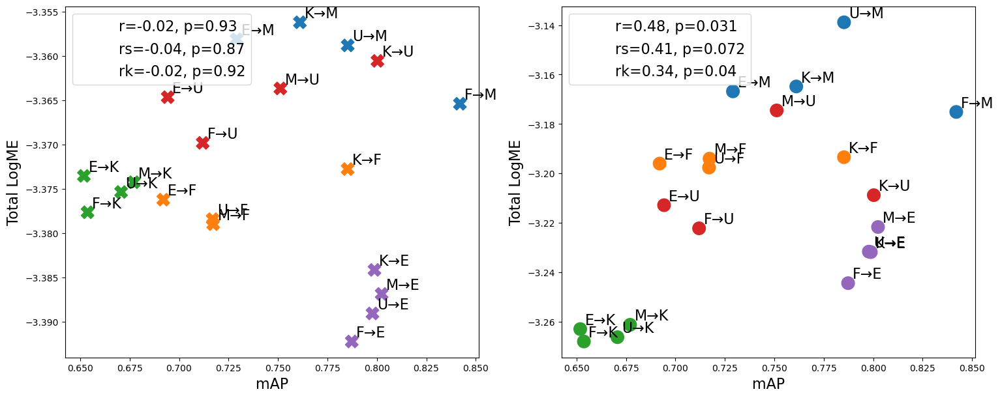

# Transferability Metrics for Object Detection

This repository is the official implementation of [Transferability Metrics for Object Detection](https://arxiv.org/abs/todo). 



## Requirements

To install requirements:

```setup
pip install -r requirements.txt
```


## Training

**references** folder contains reference scripts from pytorch for object detection. It contains many helper function that are used in other scripts and notebooks

To train the model(s) in the paper,  you can use :

**train_real_1.py** : script to train model on *Real 1* datasets (CHESS, VOC, ...). It applies  by default a training in a two-step fashion but can easily converted for one step. For each training is save the model (.ptch), the two pickles containing the train and eval loggers and a summary plot of the training

**train_real_2.py** : script to train model on *Real 2* datasets (boostrapped datasets from open_images). For each training the script save the model (.ptch), the two pickles containing the train and eval loggers and a summary plot of the training. This script support multiprocessing on multiple gpus and multiple machines

**train_synthetic.py** : script to train model on synthetic *MNIST OD Datasets. It can be used in for transfer learning or to simulate pretrained models.


## Evaluation

To evaluate my model on ImageNet, run:

```eval
python eval.py --model-file mymodel.pth --benchmark imagenet
```

>📋  Describe how to evaluate the trained models on benchmarks reported in the paper, give commands that produce the results (section below).

## Datasets
Code for generating MNIST like object detection datasets can be found in **add Simona's code**

Code for generating bootstrapped datasets from Open Images can be found in **create_oi_datasets.ipynb**

**data_load.py** : scripts with custom classes for different OD Datasets. COCO-fashion with a json containing all annotations, VOC with an xml annotation file per image, Global Wheat-fahshion with a csv containing all annotations and MNIST-like with one text file per image.

## Results

Our model achieves the following performance on :

### Correlation between mAP and transferability metrics for different tasks

| Model name         | Top 1 Accuracy  | Top 5 Accuracy |
| ------------------ |---------------- | -------------- |
| My awesome model   |     85%         |      95%       |


>📋  Include a table of results from your paper, and link back to the leaderboard for clarity and context. If your main result is a figure, include that figure and link to the command or notebook to reproduce it. 


## Contributing

Here we could redirect to the code of [thuml](https://github.com/thuml/Transfer-Learning-Library) and explain we added h-score_reg and transrate there. 
