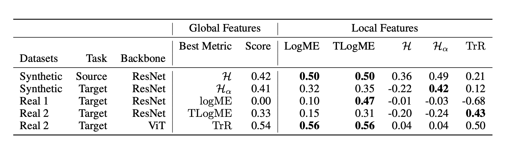

# Transferability Metrics for Object Detection

This repository is the official implementation of [Transferability Metrics for Object Detection](https://arxiv.org/abs/todo). 


## Requirements

To install requirements:

```setup
pip install -r requirements.txt
```

## Datasets

* _Synthetic_: Generation of **MNIST-like object detection datasets** is done on the top of the original datasets ([MNIST](http://yann.lecun.com/exdb/mnist/), [Fashion MNIST](https://github.com/zalandoresearch/fashion-mnist), [KMNIST](https://github.com/rois-codh/kmnist), [EMNIST](http://www.itl.nist.gov/iaui/vip/cs_links/EMNIST/gzip.zip), [USPS](https://github.com/darshanbagul/USPS_Digit_Classification/blob/master/USPSdata/USPSdata.zip)), using **[generate_data.py](https://github.com/dataiku-research/transferability_metrics_for_object_detection/blob/main/generate_data.py)** script specifying the desired dataset in the `ds_mnist` parameter. 
The parameters used to generate MNIST-like datasets are as in the following command:
`python3 generate_data.py --ds_mnist mnist --imsize 128 --min-digit-size 15 --max-digit-size 50 --num-train-images 10000 --num-test-images 1000 --max-digits-per-image 5`.

* _Real 1_: Code for generating **bootstrapped datasets from Open Images** can be found in **[create_oi_datasets.ipynb](https://github.com/dataiku-research/transferability_metrics_for_object_detection/blob/main/create_oi_datasets.ipynb)**

* _Real 2_: Other **diverse object detection datasets** can be donwloaded here : [VOC](http://host.robots.ox.ac.uk/pascal/VOC/), [CHESS](https://public.roboflow.com/object-detection/chess-full), [BCCD](https://www.tensorflow.org/datasets/catalog/bccd), [Global Wheat](https://www.kaggle.com/c/global-wheat-detection) and [Open Images](https://storage.googleapis.com/openimages/web/index.html).

**[data_load.py](https://github.com/dataiku-research/transferability_metrics_for_object_detection/blob/main/data_load.py)** : scripts with custom classes for different object detection datasets. COCO-fashion with a json containing all annotations, VOC with an xml annotation file per image, Global Wheat-fashion with a csv containing all annotations and MNIST-like with one text file per image.


## Training and Evaluation of ResNet-Faster-RCNN and ViT-Faster-RCNN

To train the model(s) on source datasets and transfer them to target datasets as described in the paper, we use :

**[train_real_1.py](https://github.com/dataiku-research/transferability_metrics_for_object_detection/blob/main/train_real_1.py)** : script to train model on *Real 1* datasets (CHESS, VOC, ...). For each training is save the model (.ptch), the two pickles containing the train and eval loggers and a summary plot of the training.

**[train_real_2.py](https://github.com/dataiku-research/transferability_metrics_for_object_detection/blob/main/train_real_2.py)** : script to train model on *Real 2* datasets (boostrapped datasets from open_images). For each training the script save the model (.ptch), the two pickles containing the train and eval loggers and a summary plot of the training. This script support multiprocessing on multiple gpus and multiple machines. It can be used to train Fatser-RCNN with both ResNet and Visual Transformer (ViT) backbone.

**[train_synthetic.py](https://github.com/dataiku-research/transferability_metrics_for_object_detection/blob/main/train_synthetic.py)** : script to train model on synthetic *MNIST OD Datasets. It can be used in for transfer learning or to simulate pretrained models.

The previous training scripts also evaluate the final mean Average Precision (mAP) for each trained or transferred model. The evaluation log containing various performance metrics (mAP_05_95, mAP_50, AR_1, AR_10) is stored in a pickle, then loaded in the results notebooks.

--

**[references](https://github.com/dataiku-research/transferability_metrics_for_object_detection/tree/main/references)** folder contains reference scripts from pytorch for object detection. It contains many helper functions that are used in other scripts and notebooks


## Extracting features

To extract the global and local level features, we specify the desired layer in the following scripts, containing one function to extract features by small batches and a function to aggregate these batches: 

**[extract_features.py](https://github.com/dataiku-research/transferability_metrics_for_object_detection/blob/main/extract_features.py)** to extract features for synthetic datasets and for *Real 1* task. 

**[extract_features_oi.py](https://github.com/dataiku-research/transferability_metrics_for_object_detection/blob/main/extract_features_oi.py)** to extract features for *Real 2* task. This script works for both ResNet and ViT backbones.


## Computing transferability metrics and correlation with transfer performance

Scripts for the different transferability metrics are in **[metric.py](https://github.com/dataiku-research/transferability_metrics_for_object_detection/blob/main/metric.py)**.

To compute correlation results, we use:
* **[results_synthetic_data.ipynb](https://github.com/dataiku-research/transferability_metrics_for_object_detection/blob/main/results_synthetic_data.ipynb)** for synthetic datasets
* **[results_real_data.ipynb](https://github.com/dataiku-research/transferability_metrics_for_object_detection/blob/main/results_real_data.ipynb)** for real datasets

The file **[plot_utils.py](https://github.com/dataiku-research/transferability_metrics_for_object_detection/blob/main/plot_utils.py)** contains helper function to draw plots and compute correlations.


## Results

### Correlation between mAP and transferability metrics for different tasks




## Contribution to open source libraries

Our implementations of TransRate and regularized H-Score have been merged in the [Transfer-Learning Library](https://github.com/thuml/Transfer-Learning-Library). For other transferability metrics we've used their implementation.

## Hardware

GPUs: 2 GeForce GTX 970 4GB + 1 Quadro P6000 24 GB

